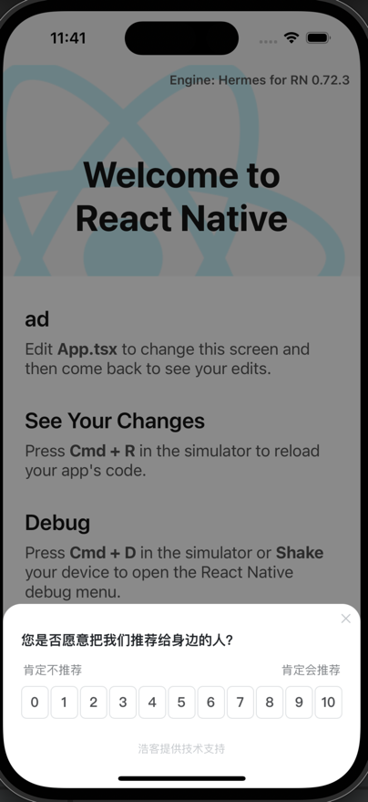

# howxm-RN-demo

> ReactNative中使用浩客SDK代码示例（目前仅支持 iOS）

## 1.安装sdk，建议使用pod安装, 详情参考参考：https://howxm.com/help/articles/ios-x-sdk
> pod 'Howxm', '版本号'

## 2.实现 RCTBridgeModule 协议
- [HowxmRN.h](ios/HowxmRN.h)
- [HowxmRN.m](ios/HowxmRN.m)


## 3.代码中调用示例，更多示例参考 - [App.tsx](App.tsx)
```typescript jsx
import { NativeModules } from "react-native";

const Howxm = NativeModules.HowxmRN;

Howxm.initializeSDK("your appid", () => {
  Howxm.event(
    "payment_click",
    { price: 100 },
    () => {
      console.info("event success");
    },
    (error: any) => {
      console.error(error);
    }
  );
});
```

## 弹框效果

